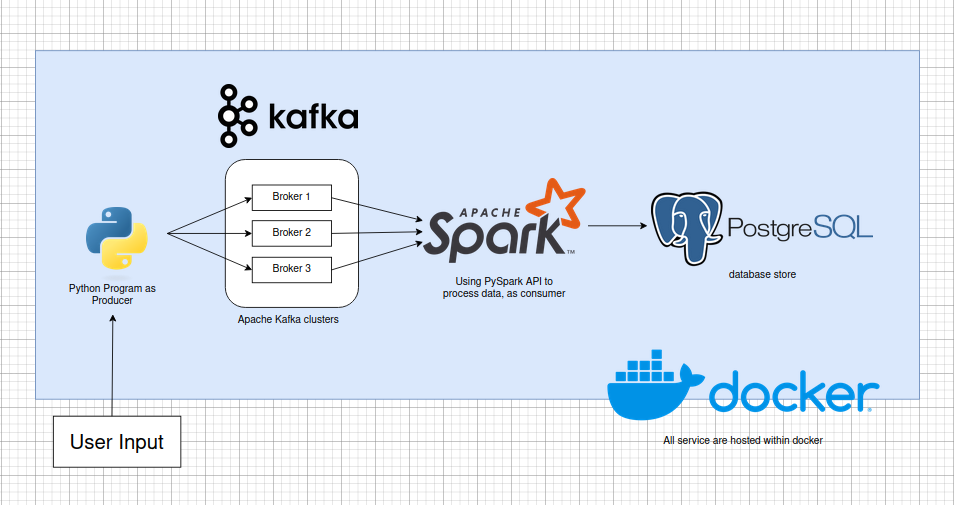

# Data Streaming with Apache Kafka & PySpark

This repository are for learning purposes for creating Data Streaming pipelines with Apache Kafka & Spark (PySpark). The project idea is simple, create a pipeline which use a python program to takes input as the kafka producer and then consumed by Apache Spark to process and store it in local Postgres (or BigQuery in the future) within docker. Please see project diagram below:

### Apache Kafka

So Apache Kafka is a distribute event and stream processing tool. There is a producer which logs an event and a consumer who consume the logs of the event. Apache Kafka uses topic that the consumer subscribes to, ensuring the consumer only get the Data they need. Imagine kafka is the middleman between two services making sure communication between the two service are correct.

Within Kafka there are brokers, nodes that are responsible for doing the work. Kafka is a distributed system, therefore we can easily add brokers to adjust neccessity of the data stream. They are also fault tolerance, with brokers backing up each other, ensuring if any of the broker are shut down another one could take the load. A group of multiple brokers are called clusters.

updates:
- Succesfully consume within a python script!

The full documentation will be written here when the project is done.

Any comments are welcome. Thank you!